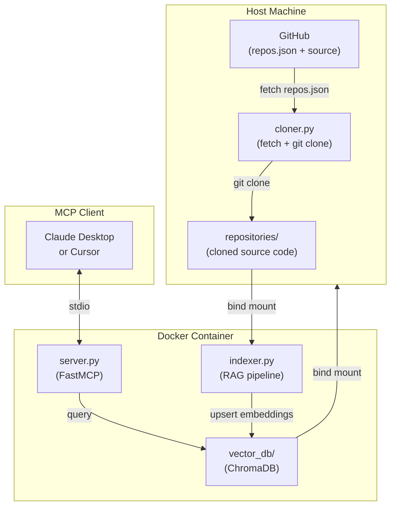

# Mock Interview RAG Server

A Dockerized MCP server that fetches your GitHub repositories, indexes them into a local vector database, and exposes semantic code search tools to an LLM client (Claude Desktop or Cursor) so it can conduct tailored technical mock interviews grounded in your actual code.

**MCP (Model Context Protocol)** is a protocol that lets LLM clients call typed tools declared by an external server. The LLM decides when to call a tool, passes typed arguments, and receives structured results — all over `stdio`. This server exposes two tools (`search_codebase` and `list_available_repositories`) that give the LLM real-time access to your source code during an interview session.

---

## Architecture

The system runs across three phases: repository ingestion on your host machine, vector embedding inside the container, and MCP tool exposure over `stdio`.



| Phase            | Component    | Responsibility                                                                                        |
| ---------------- | ------------ | ----------------------------------------------------------------------------------------------------- |
| **1. Ingestion** | `cloner.py`  | Fetches `repos.json` from GitHub and clones each repository to `repositories/`                        |
| **2. Embedding** | `indexer.py` | Walks the mounted `repositories/` directory, chunks source files, and stores embeddings in ChromaDB   |
| **3. Protocol**  | `server.py`  | Exposes `search_codebase` and `list_available_repositories` tools to any MCP-compatible client        |

---

## Prerequisites

- **Python 3.11+** — for the host-side `make clone-repos` script
- **Docker + Docker Compose** — to build and run the container
- **Git** — used by the cloner script
- **Make** — to run the convenience targets

---

## Project Structure

```text
Learn_MCP_server/
├── repositories/           # Cloned target source code (gitignored, populated by make clone-repos)
├── vector_db/              # Persistent ChromaDB storage (gitignored, populated on container start)
├── src/
│   ├── __init__.py
│   ├── repo.py             # Repo dataclass
│   ├── cloner.py           # Fetches repos.json from GitHub and git-clones each repo
│   ├── server.py           # MCP server — exposes tools to the LLM client
│   └── indexer.py          # RAG pipeline — embeds source files into ChromaDB
├── Dockerfile
├── docker-compose.yml
├── Makefile
└── requirements.txt
```

---

## Quick Start

```bash
# 1. Clone this repository
git clone https://github.com/TheTangentLine/Learn_MCP_server
cd Learn_MCP_server

# 2. Clone target repos, build the image, and start the server (detached)
make run

# 3. Add the server to your MCP client config (see below)
```

`make run` chains `clone-repos` → `build` → `docker compose up -d` in one step.

**Other useful targets:**

| Target            | Command           | Description                                  |
| ----------------- | ----------------- | -------------------------------------------- |
| Clone repos only  | `make clone-repos`| Fetch `repos.json` from GitHub and git-clone |
| Build image only  | `make build`      | Build the Docker image without starting      |
| Tail logs         | `make logs`       | Follow live container output                 |
| Stop & clean up   | `make down`       | Stop the container and remove it             |

---

## Connecting to an MCP Client

Once the container is running, register it in your MCP client's configuration file.

**Claude Desktop** (`~/Library/Application Support/Claude/claude_desktop_config.json`):

```json
{
  "mcpServers": {
    "mock-interview": {
      "command": "docker",
      "args": [
        "compose",
        "-f",
        "/path/to/Learn_MCP_server/docker-compose.yml",
        "run",
        "--rm",
        "mcp-server"
      ]
    }
  }
}
```

**Cursor** (`.cursor/mcp.json` in your project or `~/.cursor/mcp.json` globally):

```json
{
  "mcpServers": {
    "mock-interview": {
      "command": "docker",
      "args": [
        "compose",
        "-f",
        "/path/to/Learn_MCP_server/docker-compose.yml",
        "run",
        "--rm",
        "mcp-server"
      ]
    }
  }
}
```

Restart your client after saving the config to load the new server.

---

For implementation details — component code, concept explanations, and troubleshooting — see [docs/docs.md](docs/docs.md).
