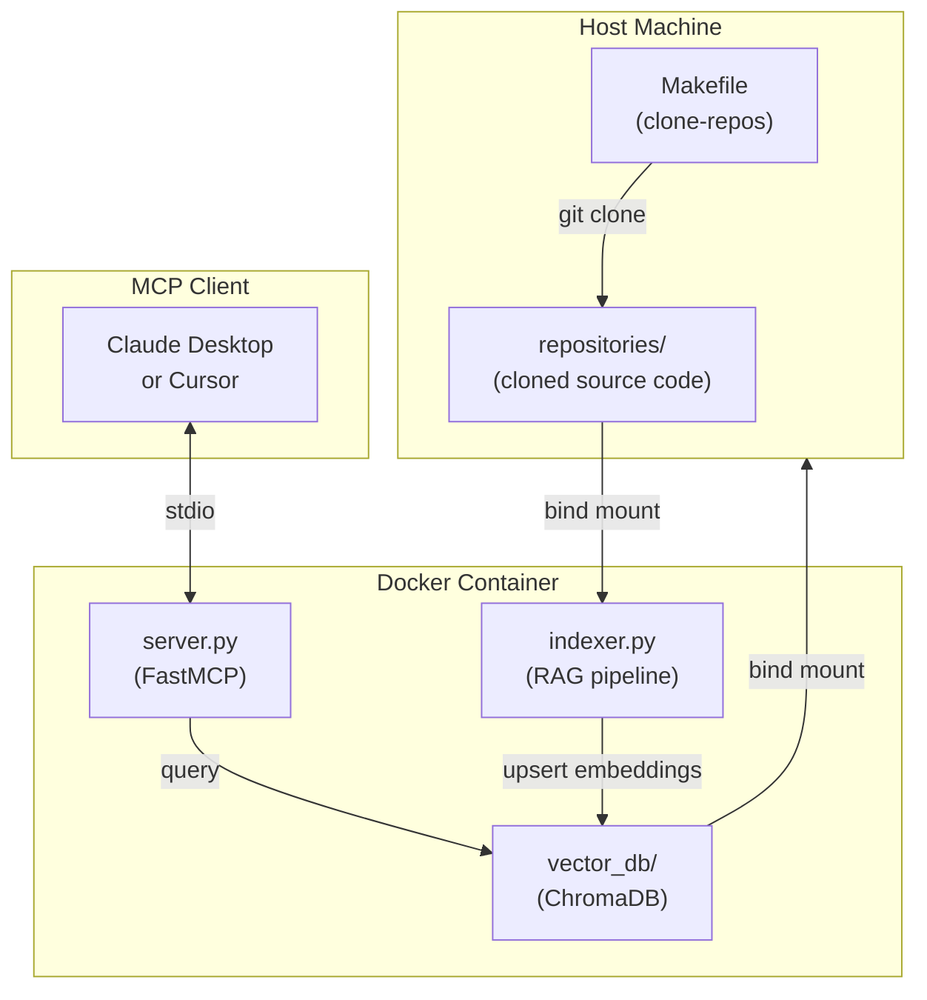

# Mock Interview RAG Server

A Dockerized MCP server that clones your GitHub repositories, indexes them into a local vector database, and exposes semantic code search tools to an LLM client (Claude Desktop or Cursor) so it can conduct tailored technical mock interviews grounded in your actual code.

---

## Architecture

The system runs across three phases: repository ingestion on your host machine, vector embedding inside the container, and MCP tool exposure over `stdio`.



| Phase            | Component    | Responsibility                                                                                      |
| ---------------- | ------------ | --------------------------------------------------------------------------------------------------- |
| **1. Ingestion** | `Makefile`   | Fetches `repos.json` from GitHub and clones each repository to `repositories/`                      |
| **2. Embedding** | `indexer.py` | Walks the mounted `repositories/` directory, chunks source files, and stores embeddings in ChromaDB |
| **3. Protocol**  | `server.py`  | Exposes `search_codebase` and `list_available_repositories` tools to any MCP-compatible client      |

---

## Prerequisites

- **Python 3.11+** — for the host-side `make clone-repos` script
- **Docker + Docker Compose** — to build and run the container
- **Git** — used by the Makefile clone script
- **Make** — to run the convenience targets

---

## Project Structure

```text
mcp-mock-interview/
├── data/
│   └── repos.json          # Cached or downloaded repo list
├── repositories/           # Cloned target source code (gitignored)
├── vector_db/              # Persistent ChromaDB storage (gitignored)
├── src/
│   ├── __init__.py
│   ├── server.py           # MCP server definition
│   └── indexer.py          # RAG parsing & embedding logic
├── Dockerfile
├── docker-compose.yml
├── Makefile
└── requirements.txt
```

---

## Quick Start

```bash
# 1. Clone this repository
git clone https://github.com/TheTangentLine/mcp-mock-interview.git
cd mcp-mock-interview

# 2. Clone target repos, build the image, and start the server
make run

# 3. Add the server to your MCP client config (see below)
```

`make run` chains `clone-repos` → `build` → `docker compose up` in one step.

---

## Connecting to an MCP Client

Once the container is running, register it in your MCP client's configuration file.

**Claude Desktop** (`~/Library/Application Support/Claude/claude_desktop_config.json`):

```json
{
  "mcpServers": {
    "mock-interview": {
      "command": "docker",
      "args": [
        "compose",
        "-f",
        "/path/to/mcp-mock-interview/docker-compose.yml",
        "run",
        "--rm",
        "mcp-server"
      ]
    }
  }
}
```

**Cursor** (`.cursor/mcp.json` in your project or `~/.cursor/mcp.json` globally):

```json
{
  "mcpServers": {
    "mock-interview": {
      "command": "docker",
      "args": [
        "compose",
        "-f",
        "/path/to/mcp-mock-interview/docker-compose.yml",
        "run",
        "--rm",
        "mcp-server"
      ]
    }
  }
}
```

Restart your client after saving the config to load the new server.

---

For implementation details — component code, chunking strategy, and container configuration — see [docs.md](docs/docs.md).
