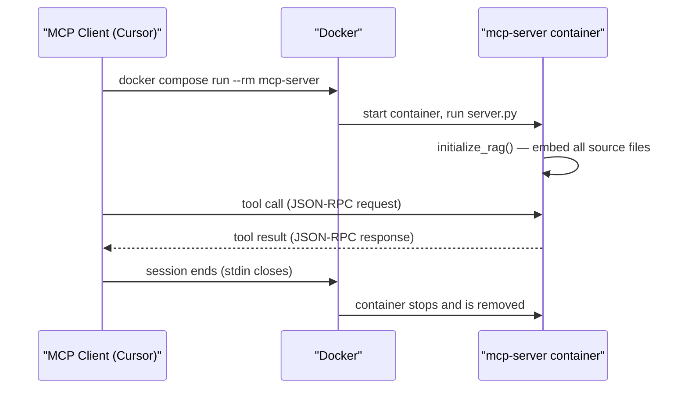
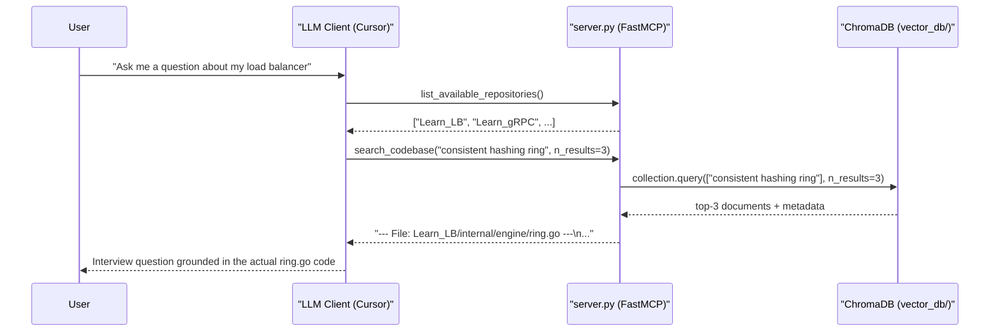
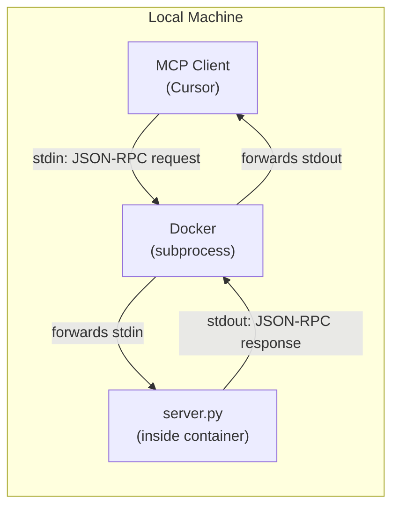
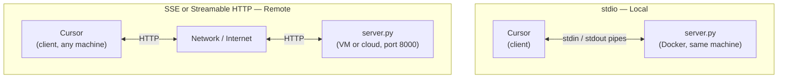

# Technical Reference

> For project overview, prerequisites, quick start, and client configuration see [README.md](../README.md).

---

## Background Concepts

### MCP (Model Context Protocol)

MCP is a protocol that lets an LLM client (Cursor, Claude Desktop) call typed external tools at runtime. The server declares tools with names, argument schemas, and return types. When the LLM decides it needs information — such as a list of available codebases or a relevant code snippet — it issues a tool call by name with typed arguments. The server executes the call and returns a result that the LLM incorporates into its next response. All communication happens over a transport layer — this project uses `stdio` (local subprocess pipes), but MCP also supports HTTP-based transports for remote deployments. See [MCP Transports](#mcp-transports) for a full comparison.

For the full protocol internals — how the handshake works, how tool schemas are discovered, and the JSON-RPC message format — see [mcp-protocol.md](mcp-protocol.md).

This server exposes two tools:

| Tool                          | Purpose                                                       |
| ----------------------------- | ------------------------------------------------------------- |
| `list_available_repositories` | Discover which codebases are currently mounted and indexed    |
| `search_codebase`             | Retrieve code snippets semantically relevant to a query       |

### RAG (Retrieval-Augmented Generation)

Rather than relying solely on what an LLM learned during training, RAG retrieves relevant context at query time and injects it into the prompt. This matters for mock interviews because the LLM needs to ask questions grounded in *your specific code*, not generic textbook examples. The retrieval step happens transparently: the LLM calls `search_codebase`, gets back the actual source snippets, then uses them to formulate a precise, contextual question.

### Vector Embeddings and Semantic Search

Each source file is converted to a fixed-size numeric vector (an *embedding*) by the `all-MiniLM-L6-v2` sentence-transformer model. Conceptually, files with similar meaning end up as nearby points in a high-dimensional space. When a query like `"JWT authentication middleware"` arrives, it is also embedded into the same space, and ChromaDB returns the *k* nearest stored vectors — i.e., the files whose content is most semantically related to the query. This is fundamentally different from keyword search: it finds conceptually similar code even if it uses different variable names or comments.

`all-MiniLM-L6-v2` was chosen because it:
- Runs entirely on CPU (no GPU required)
- Downloads once and is ~80 MB
- Produces high-quality embeddings for both prose and code
- Is the ChromaDB default, so no extra configuration is needed

---

## Components

### 1. Repository Model (`src/repo.py`)

A lightweight dataclass representing one entry from `repos.json`:

```python
class Repo:
    def __init__(self, slug: str, label: str, category: str, username: str):
        self.slug = slug        # GitHub repo name, used as the clone directory name
        self.label = label      # Human-readable display name
        self.category = category  # Topic tag (e.g. "infra", "networking")
        self.username = username  # GitHub username that owns the repo
```

| Field      | Example               | Used for                                          |
| ---------- | --------------------- | ------------------------------------------------- |
| `slug`     | `"Learn_LB"`          | Clone destination path and ChromaDB `repo` metadata |
| `label`    | `"Load Balancer"`     | Human-readable display                            |
| `category` | `"infra"`             | Grouping / filtering (not yet used by the server) |
| `username` | `"TheTangentLine"`    | Constructing the GitHub clone URL                 |

---

### 2. Ingestion Pipeline (`src/cloner.py` + `Makefile`)

Repository ingestion runs on the host machine (not inside the container). Keeping source code outside the image means:
- The Docker image stays small and rebuilds quickly — only `src/` and `requirements.txt` are baked in
- Updating a repository only requires re-running `make clone-repos`, not a full `docker compose build`
- The same `repositories/` volume can be reused across multiple image versions

#### `cloner.py`

`cloner.py` has two responsibilities: fetching the list of repositories from GitHub, and cloning them locally.

**`fetch_repos()`** downloads `repos.json` from a fixed URL:

```
https://raw.githubusercontent.com/TheTangentLine/learn/main/data/repos.json
```

The expected schema is a JSON array of repo objects:

```json
[
  {
    "slug": "Learn_LB",
    "label": "Load Balancer",
    "category": "infra",
    "username": "TheTangentLine"
  },
  {
    "slug": "Learn_gRPC",
    "label": "gRPC Service",
    "category": "networking",
    "username": "TheTangentLine"
  }
]
```

The parser also accepts an object with a top-level `"repos"` key wrapping the array, for forward compatibility.

**`clone_repos()`** iterates the list and clones each repo to `repositories/<slug>/`. It checks for an existing directory before calling `git clone`, making it **idempotent** — safe to run repeatedly without duplicating work:

```python
def clone_repos(repos: list[Repo]) -> None:
    os.makedirs(REPOS_DIR, exist_ok=True)
    for repo in repos:
        dest = os.path.join(REPOS_DIR, repo.slug)
        if os.path.exists(dest):
            print(f"  skip  {repo.slug} (already exists)")
            continue
        url = f"https://github.com/{repo.username}/{repo.slug}.git"
        print(f"  clone {url}")
        subprocess.run(["git", "clone", url, dest], check=True)
```

#### `Makefile`

```makefile
.PHONY: clone-repos build run logs down

clone-repos:
	@echo "Cloning repositories..."
	python3 src/cloner.py

build:
	docker compose build

run: clone-repos build
	docker compose up -d

logs:
	docker compose logs -f mcp-server

down:
	docker compose down
```

| Target        | Description                                                        |
| ------------- | ------------------------------------------------------------------ |
| `clone-repos` | Fetch `repos.json` from GitHub and git-clone any missing repos     |
| `build`       | Build the Docker image from `Dockerfile`                           |
| `run`         | Full pipeline: clone → build → start container in detached mode    |
| `logs`        | Tail live output from the running container (`-f` follows)         |
| `down`        | Stop the container and remove it                                   |

---

### Startup & Reconnection Guide

There are two distinct ways to run this server. Understanding the difference determines whether you need to run any `make` commands after the first-time setup.

#### Mode 1: Ephemeral per-session (MCP client config — the normal way)

The client config in Cursor or Claude Desktop uses `docker compose run --rm`:

```json
{
  "mcpServers": {
    "mock-interview": {
      "command": "docker",
      "args": ["compose", "-f", "/path/to/docker-compose.yml", "run", "--rm", "mcp-server"]
    }
  }
}
```

This is entirely self-contained. Every time you open a new chat session, the client:
1. Spawns a fresh container
2. Waits for `initialize_rag()` to finish indexing
3. Begins the MCP session
4. Removes the container when the session ends (`--rm`)

No pre-running container is needed. If the Docker image doesn't exist yet, `docker compose run` builds it automatically.



#### Mode 2: Persistent background container (`make run`)

`make run` calls `docker compose up -d`, which starts a long-running detached container. This is useful when you want to:
- Inspect live logs with `make logs`
- Keep the server warm between sessions (avoids the re-indexing delay on each chat open)
- Debug startup or indexing issues

When using this mode, the client config still works the same way — it creates a *separate* ephemeral container per session alongside the persistent one. If you want the client to attach to the persistent container instead, you would need a different client config (e.g. using `url` with a network transport — see [MCP Transports](#mcp-transports) below).

#### What you actually need to run after first-time setup

| Requirement | Command | Frequency |
|---|---|---|
| Populate `repositories/` | `make clone-repos` | Once on setup; re-run to add new repos |
| Build the Docker image | `make build` (or auto-built on first session) | Once; re-run after changes to `src/` |
| Start a session | Open a chat in Cursor/Claude | Every session — handled automatically |

You do **not** need `make run` if you are relying on the MCP client config. The client config is fully self-sufficient.

#### Startup time

The first session after `make clone-repos` is slow — `initialize_rag()` must read every source file and compute embeddings for each one. This can take **30–60 seconds** depending on how many repos are indexed.

Subsequent sessions reuse the persisted `vector_db/` bind mount and skip re-embedding unchanged files (upsert by path ID). Cold start on an already-indexed database is typically **2–5 seconds**.

---

### 3. RAG Indexer (`src/indexer.py`)

`initialize_rag()` runs **at container startup** (before the MCP server begins accepting calls). It walks `repositories/`, reads every source file, and upserts its content into ChromaDB. On the first run this populates the vector database; on subsequent runs ChromaDB updates any changed files in-place.

#### Chunking strategy

| Decision                    | Implementation                                                                  |
| --------------------------- | ------------------------------------------------------------------------------- |
| File types indexed          | `.py`, `.go`, `.java`, `.cpp`, `.js`, `.ts` only — binary and lock files excluded |
| Granularity                 | One document per file (whole-file chunks)                                       |
| Document ID                 | `rel_path` — the file's path relative to `repositories/`                        |
| Metadata stored             | `source` (rel_path), `filename`, `repo` (top-level directory name)              |

Using the relative path as the document ID has a key property: **upsert is idempotent**. If the container restarts and re-indexes the same file, ChromaDB replaces the existing entry rather than creating a duplicate. This means you never need to manually clear the database between runs.

#### Metadata fields

```python
collection.upsert(
    documents=[content],
    metadatas=[{
        "source": rel_path,   # e.g. "Learn_LB/internal/engine/ring.go"
        "filename": filename, # e.g. "ring.go"
        "repo": repo_name,    # e.g. "Learn_LB"
    }],
    ids=[rel_path],
)
```

- `source` is included in every search result returned to the LLM, so it knows exactly which file a snippet came from
- `repo` enables future filtering (e.g. only search within one repository)
- `filename` is available for display or filtering by file name without parsing the full path

#### Full source

```python
import os

import chromadb
from chromadb.utils import embedding_functions

REPOS_DIR = "/app/repositories"
VECTOR_DB_DIR = "/app/vector_db"
COLLECTION_NAME = "repo_codebase"
EMBEDDING_MODEL = "all-MiniLM-L6-v2"

SOURCE_EXTENSIONS = {".py", ".go", ".java", ".cpp", ".js", ".ts"}


def initialize_rag() -> chromadb.Collection:
    client = chromadb.PersistentClient(path=VECTOR_DB_DIR)

    emb_fn = embedding_functions.SentenceTransformerEmbeddingFunction(
        model_name=EMBEDDING_MODEL
    )

    collection = client.get_or_create_collection(
        name=COLLECTION_NAME,
        embedding_function=emb_fn,
    )

    if not os.path.exists(REPOS_DIR):
        print(f"[indexer] repositories dir not found at {REPOS_DIR}, skipping indexing.")
        return collection

    indexed = 0
    for root, _, files in os.walk(REPOS_DIR):
        for filename in files:
            if os.path.splitext(filename)[1] not in SOURCE_EXTENSIONS:
                continue

            file_path = os.path.join(root, filename)
            try:
                with open(file_path, "r", errors="ignore") as f:
                    content = f.read()
            except OSError:
                continue

            if not content.strip():
                continue

            rel_path = os.path.relpath(file_path, REPOS_DIR)
            repo_name = rel_path.split(os.sep)[0]

            collection.upsert(
                documents=[content],
                metadatas=[{
                    "source": rel_path,
                    "filename": filename,
                    "repo": repo_name,
                }],
                ids=[rel_path],
            )
            indexed += 1

    print(f"[indexer] Indexed {indexed} files into ChromaDB.")
    return collection
```

---

### 4. MCP Server (`src/server.py`)

Uses the official Anthropic `mcp` Python SDK via `FastMCP`. The server is initialized once at module load time (calling `initialize_rag()`) and then enters a blocking loop waiting for tool calls over `stdio`.

#### Tool: `list_available_repositories`

```python
def list_available_repositories() -> list[str]
```

Returns the names of all directories in `/app/repositories` — i.e., one entry per cloned repo. Returns an empty list if the directory does not exist (rather than raising an error), so the LLM receives a graceful response even if the volume is not mounted.

**Example return value:**
```json
["Learn_LB", "Learn_gRPC", "Learn_interpreter", "Learn_rate_limiter"]
```

**When the LLM calls this:** At the start of an interview session to discover what codebases are available before deciding which topic to focus on.

---

#### Tool: `search_codebase`

```python
def search_codebase(query: str, n_results: int = 3) -> str
```

| Parameter  | Type  | Default | Description                                             |
| ---------- | ----- | ------- | ------------------------------------------------------- |
| `query`    | `str` | —       | Natural language or code description to search for      |
| `n_results`| `int` | `3`     | Maximum number of file chunks to return                 |

Runs `collection.query()` against ChromaDB, which embeds the query and returns the `n_results` most semantically similar stored documents.

**Example return value** (formatted as a single string):
```
--- File: Learn_LB/internal/engine/ring.go ---
package engine

import (
    "hash/fnv"
    "sort"
    ...
)
...

--- File: Learn_LB/internal/engine/orchestrator.go ---
...
```

**When the LLM calls this:** After identifying a topic (e.g. from `list_available_repositories`), the LLM silently calls `search_codebase` with a relevant query to pull the actual code it will base an interview question on.

---

#### `stdio` transport and Docker requirements

`server.py` runs with `transport="stdio"`:

```python
if __name__ == "__main__":
    mcp.run(transport="stdio")
```

The MCP client sends JSON-encoded tool calls to the container's `stdin` and reads results from `stdout`. This requires Docker Compose to keep those streams open:

```yaml
services:
  mcp-server:
    build: .
    volumes:
      - ./repositories:/app/repositories
      - ./vector_db:/app/vector_db
    stdin_open: true   # keeps stdin open (equivalent to docker run -i)
    tty: true          # allocates a pseudo-TTY (equivalent to docker run -t)
```

Without `stdin_open: true`, the container exits immediately after startup because its stdin closes.

---

### 5. Container Configuration

#### `Dockerfile`

```dockerfile
FROM python:3.11-slim

WORKDIR /app

RUN apt-get update && apt-get install -y --no-install-recommends \
    build-essential \
    && rm -rf /var/lib/apt/lists/*

COPY requirements.txt .
RUN pip install --no-cache-dir -r requirements.txt

COPY src/ ./src/

CMD ["python", "src/server.py"]
```

`build-essential` is required at build time because `chromadb` compiles native extensions (SQLite bindings, ONNX runtime). It is not needed at runtime.

The `repositories/` and `vector_db/` directories are intentionally **not** copied into the image — they are supplied at runtime via bind mounts, keeping the image small and the source code easy to update without a rebuild.

#### `requirements.txt`

```
mcp
chromadb
sentence-transformers
```

| Package               | Role                                                                      |
| --------------------- | ------------------------------------------------------------------------- |
| `mcp`                 | Official Anthropic MCP Python SDK; provides `FastMCP` and `stdio` runner  |
| `chromadb`            | Embedded vector database; handles embedding storage and ANN search        |
| `sentence-transformers` | Loads and runs the `all-MiniLM-L6-v2` embedding model locally           |

---

## Data & Request Flow

The following trace walks through a complete mock interview interaction, from user message to LLM response.



Key observations:
- The LLM drives both tool calls autonomously — the user never sees them
- `list_available_repositories` is typically called once per session; `search_codebase` is called once per question
- The formatted snippet returned by `search_codebase` is injected directly into the LLM's context window, giving it exact line-level visibility into your code

---

## Interview Flow

Once connected, the interaction works as follows:

1. **User** tells the LLM client: _"I want to do a mock interview based on the repositories available."_
2. **LLM client** calls `list_available_repositories` via the MCP server to discover what codebases are loaded.
3. **LLM client** proposes a topic: _"I see we have a load balancer and a rate limiter. Let's start with the consistent hashing implementation in your load balancer."_
4. **LLM client** silently calls `search_codebase(query="consistent hashing ring addServer findServer")` to retrieve the relevant source snippets.
5. **LLM client** formulates a tailored interview question using the retrieved snippet as direct context, citing specific function names, line logic, and design decisions from your code.

---

## Troubleshooting

### `No results found.` on every search

The `repositories/` directory is empty or not mounted. Run `make clone-repos` on the host to populate it, then restart the container with `make run`.

### Container exits immediately after starting

`stdin_open: true` and/or `tty: true` are missing from `docker-compose.yml`. The MCP server blocks on stdin; without an open stdin stream the process has nothing to read and exits with code 0.

### Embeddings are recomputed from scratch on every restart

The `vector_db/` volume is not mounted. Verify the `docker-compose.yml` contains:
```yaml
volumes:
  - ./vector_db:/app/vector_db
```
Without this bind mount, ChromaDB writes to a temporary path inside the container that disappears on `docker compose down`.

### `git clone` fails during `make clone-repos`

Check that:
- The repository listed in `repos.json` is **public** on GitHub
- Your machine has network access to `github.com`
- `git` is installed and on your `PATH`

To verify the repo list being fetched, open the URL directly in a browser:
```
https://raw.githubusercontent.com/TheTangentLine/learn/main/data/repos.json
```

---

## Extending the Server

### Adding a new MCP tool

Decorate any function with `@mcp.tool()` in `src/server.py`. FastMCP automatically generates the JSON schema from the function's type hints and docstring — no manual schema definition required:

```python
@mcp.tool()
def search_by_repo(repo: str, query: str, n_results: int = 3) -> str:
    """
    Searches a specific repository by name rather than across all indexed code.
    """
    results = collection.query(
        query_texts=[query],
        n_results=n_results,
        where={"repo": repo},
    )
    # ... format and return
```

Rebuild the image (`make build`) and restart for the new tool to appear in the client.

### Finer-grained chunking

The current indexer stores one document per file. For large files (thousands of lines), this means a single ChromaDB entry must represent the semantics of the whole file, which reduces retrieval precision.

A natural improvement is to split each file by **function or class boundary** before upserting — using `tree-sitter` or language-specific parsers — and store each function as its own document. The ID could be `rel_path::function_name` to keep upserts idempotent. This would let `search_codebase` return the specific function relevant to a query rather than the whole file.

### Filtering search by repository or language

ChromaDB supports `where` filters on metadata fields at query time. Since every document stores `repo` and `filename` metadata, you can scope a search to a single repository or file type without re-indexing:

```python
results = collection.query(
    query_texts=[query],
    n_results=n_results,
    where={"repo": "Learn_LB"},  # only search the load balancer codebase
)
```

Exposing this as a parameter on `search_codebase` (or as a separate tool) would let the LLM ask more targeted questions when the user specifies a topic.

---

## MCP Transports

MCP separates the *protocol* (how tools are declared, called, and return results) from the *transport* (how bytes flow between client and server). The same `server.py` code can run locally as a subprocess or remotely over HTTP by changing a single argument.

### The three transport options

| Transport | How it works | Best for |
|---|---|---|
| `stdio` | Client spawns the server as a subprocess; communicates over stdin/stdout pipes | Local machine — current project |
| SSE (Server-Sent Events) | Server runs as an HTTP server; client opens a persistent GET stream for events, sends tool calls via POST | Remote server, LAN, cloud — older MCP clients |
| Streamable HTTP | Single HTTP endpoint handles both directions using chunked transfer encoding | Remote server, LAN, cloud — preferred for new deployments |

---

### `stdio` — local subprocess (this project)

`stdio` is the standard transport for any MCP server that runs on the same machine as the client. The client config specifies a shell command to run; the MCP client executes it as a subprocess and pipes JSON-RPC messages through stdin/stdout.

```json
{
  "mcpServers": {
    "mock-interview": {
      "command": "docker",
      "args": ["compose", "-f", "/path/to/docker-compose.yml", "run", "--rm", "mcp-server"]
    }
  }
}
```

What happens at the transport level:
1. Cursor runs the `docker compose run` command as a child process
2. It writes JSON-encoded tool call requests to the process's `stdin`
3. It reads JSON-encoded tool results from the process's `stdout`
4. When the session ends, stdin closes, which signals the container to stop



**Characteristics of `stdio`:**
- Zero network configuration — no ports, no firewalls
- Inherently private — nothing is exposed to the network
- One server instance per client machine — the container is spawned fresh for each session
- Requires Docker to be installed and running on the client machine

---

### SSE — remote HTTP server (legacy)

SSE (Server-Sent Events) was the original MCP network transport. The server runs as a persistent HTTP service. The client connects to it over the network instead of spawning a subprocess.

**When to use SSE:**
- You want to run the server on a remote VM or cloud instance so multiple team members can share it
- You want to avoid installing Docker on every client machine
- Your MCP client only supports SSE (older versions of Claude Desktop)

**How the transport works:**
- Client opens a persistent `GET /sse` connection — the server pushes tool results back as SSE events over this long-lived stream
- Client sends tool call requests via `POST /messages`
- Two separate HTTP connections handle the two directions of communication

**Switching this project to SSE:**

In `src/server.py`, change the transport argument:

```python
# Before (local stdio)
mcp.run(transport="stdio")

# After (remote SSE)
mcp.run(transport="sse", host="0.0.0.0", port=8000)
```

Expose the port in `docker-compose.yml`:

```yaml
services:
  mcp-server:
    build: .
    ports:
      - "8000:8000"
    volumes:
      - ./repositories:/app/repositories
      - ./vector_db:/app/vector_db
    # stdin_open and tty are no longer needed for HTTP transports
```

Update the client config to use a URL instead of a command:

```json
{
  "mcpServers": {
    "mock-interview": {
      "url": "http://your-server-address:8000/sse"
    }
  }
}
```

---

### Streamable HTTP — remote HTTP server (modern, preferred)

Streamable HTTP is the newer MCP transport that replaces SSE. It uses a single HTTP endpoint with chunked transfer encoding, handling both directions over one connection. It is more efficient and simpler to proxy behind a reverse proxy like nginx or Caddy.

**Switching this project to Streamable HTTP:**

```python
mcp.run(transport="streamable-http", host="0.0.0.0", port=8000)
```

The client config uses the same `url` format, pointing at `/mcp` instead of `/sse`:

```json
{
  "mcpServers": {
    "mock-interview": {
      "url": "http://your-server-address:8000/mcp"
    }
  }
}
```

The `docker-compose.yml` port exposure is identical to the SSE example above.

---

### Side-by-side comparison



| Property | `stdio` | SSE / Streamable HTTP |
|---|---|---|
| Server location | Same machine as client | Anywhere with a network address |
| Client config key | `command` + `args` | `url` |
| Docker required on client | Yes | No |
| Shared across machines | No | Yes |
| Network exposure | None | Port must be open |
| Auth required | No (OS-level isolation) | Yes (for any non-localhost deployment) |
| Startup per session | Fresh container each time | Server runs persistently |

---

### Security considerations for remote transports

`stdio` provides security by isolation — the server process is only reachable through the client that spawned it. Remote transports expose an HTTP port, which changes the threat model:

- **Use HTTPS** — run behind a reverse proxy (nginx, Caddy) with a TLS certificate, or use a managed platform that handles TLS
- **Add authentication** — FastMCP supports auth middleware. At minimum, validate a shared secret API key on every request:

```python
from mcp.server.fastmcp import FastMCP

mcp = FastMCP("Mock Interview RAG Server")

# FastMCP auth middleware (check docs for current API)
# Reject any request missing the correct Authorization header
```

- **The MCP spec** defines an `Authorization` header mechanism (`Bearer <token>`) that MCP clients know how to send — configure it in the client config's `headers` field:

```json
{
  "mcpServers": {
    "mock-interview": {
      "url": "https://your-server:8000/mcp",
      "headers": {
        "Authorization": "Bearer your-secret-token"
      }
    }
  }
}
```

- **Localhost is safe without auth** — if the server only listens on `127.0.0.1` (not `0.0.0.0`), it is inaccessible from other machines and auth is optional
