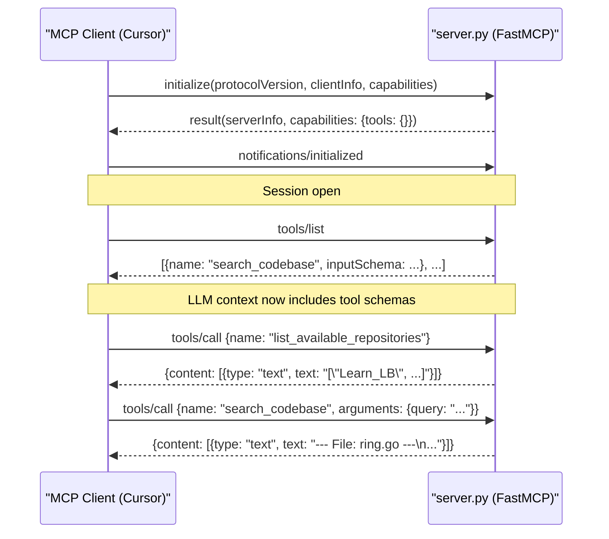
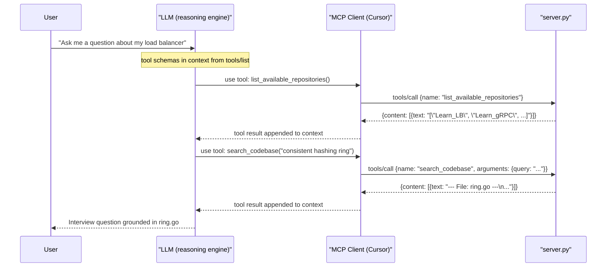

# MCP Protocol Internals

> This document explains how the MCP protocol works under the hood — the handshake, tool discovery, message format, and how the LLM agent learns what tools are available. For component code, setup, and transports see [docs.md](docs.md).

---

## The Protocol Layer: JSON-RPC 2.0

MCP is built on top of **JSON-RPC 2.0**. Every message sent between the client and server is a JSON object with a standard envelope:

```json
{
  "jsonrpc": "2.0",
  "id": 1,
  "method": "tools/list",
  "params": {}
}
```

There are two types of messages:

| Type | Has `id`? | Expects a reply? | Used for |
|---|---|---|---|
| **Request** | Yes | Yes | Tool calls, initialization, tool discovery |
| **Notification** | No | No | Signalling state changes (e.g. "I'm ready") |

The transport (stdio, SSE, Streamable HTTP) is responsible for carrying these messages between client and server. The MCP protocol layer sits above it and doesn't care which transport is used.

---

## The Initialization Handshake

Before any tool calls happen, the client and server go through a **3-step handshake** to agree on protocol version and capabilities. This is where the agent first learns that tools exist.

### Step 1 — Client sends `initialize`

The client announces itself — its name, version, and which MCP protocol version it wants to use. It also declares what MCP features it supports (called *capabilities*).

```json
{
  "jsonrpc": "2.0",
  "id": 1,
  "method": "initialize",
  "params": {
    "protocolVersion": "2024-11-05",
    "clientInfo": {
      "name": "cursor",
      "version": "1.0.0"
    },
    "capabilities": {}
  }
}
```

### Step 2 — Server responds with its capabilities

The server replies with its own identity and — critically — declares which MCP features it supports. Including `"tools": {}` in the capabilities tells the client: *"I have tools you can call."*

```json
{
  "jsonrpc": "2.0",
  "id": 1,
  "result": {
    "protocolVersion": "2024-11-05",
    "serverInfo": {
      "name": "Mock Interview RAG Server",
      "version": "1.0.0"
    },
    "capabilities": {
      "tools": {}
    }
  }
}
```

If the server did not include `"tools"` in capabilities, the client would know not to bother calling `tools/list`.

### Step 3 — Client sends `notifications/initialized`

A notification (no `id`, no reply expected) confirming the handshake is complete. The session is now open.

```json
{
  "jsonrpc": "2.0",
  "method": "notifications/initialized"
}
```

---

## Tool Discovery: `tools/list`

Immediately after the handshake, the client sends a `tools/list` request to fetch the full schema of every tool the server exposes. This is the moment the LLM agent learns exactly what tools exist, what they do, and what arguments they accept.

### Request

```json
{
  "jsonrpc": "2.0",
  "id": 2,
  "method": "tools/list"
}
```

### Response

The server returns an array of tool descriptors. Each descriptor includes a `name`, a `description`, and an `inputSchema` (JSON Schema format) describing the parameters.

This is what FastMCP generates from `server.py` for this project:

```json
{
  "jsonrpc": "2.0",
  "id": 2,
  "result": {
    "tools": [
      {
        "name": "search_codebase",
        "description": "Searches the cloned repositories for relevant code context, architectural patterns, or language implementations matching the query.",
        "inputSchema": {
          "type": "object",
          "properties": {
            "query": {
              "type": "string"
            },
            "n_results": {
              "type": "integer",
              "default": 3
            }
          },
          "required": ["query"]
        }
      },
      {
        "name": "list_available_repositories",
        "description": "Returns a list of repositories currently loaded in the RAG context.",
        "inputSchema": {
          "type": "object",
          "properties": {}
        }
      }
    ]
  }
}
```

### How FastMCP generates this automatically

FastMCP inspects the decorated functions in `server.py` at startup and builds the schema without any manual configuration:

```python
@mcp.tool()
def search_codebase(query: str, n_results: int = 3) -> str:
    """
    Searches the cloned repositories for relevant code context,
    architectural patterns, or language implementations matching the query.
    """
    ...
```

| Python source | JSON Schema field |
|---|---|
| Function name `search_codebase` | `"name": "search_codebase"` |
| Docstring | `"description": "Searches the cloned repositories..."` |
| `query: str` (no default) | `"query": {"type": "string"}` + added to `"required"` |
| `n_results: int = 3` (has default) | `"n_results": {"type": "integer", "default": 3}` — not in `"required"` |

This is why the docstring and type hints in `server.py` matter — they are the exact text the LLM reads when deciding whether and how to call a tool.

---

## Full Connection Sequence



---

## A Tool Call in Detail: `tools/call`

When the LLM decides to invoke a tool, the MCP client sends a `tools/call` request:

### Request

```json
{
  "jsonrpc": "2.0",
  "id": 3,
  "method": "tools/call",
  "params": {
    "name": "search_codebase",
    "arguments": {
      "query": "consistent hashing ring findServer",
      "n_results": 3
    }
  }
}
```

### Response

The result is wrapped in a `content` array. Each item has a `type` and a `text` (or `image`, or `resource` for other tool types). This server always returns a single `text` item.

```json
{
  "jsonrpc": "2.0",
  "id": 3,
  "result": {
    "content": [
      {
        "type": "text",
        "text": "--- File: Learn_LB/internal/engine/ring.go ---\npackage engine\n\nimport (\n\t\"hash/fnv\"\n\t\"sort\"\n\t...\n)\n..."
      }
    ],
    "isError": false
  }
}
```

If the tool raises an exception, `isError` is set to `true` and `text` contains the error message. The LLM client handles this gracefully without crashing the session.

---

## How the LLM Decides to Call a Tool

The tool schemas fetched via `tools/list` are **injected into the LLM's context** by the MCP client — typically as part of the system prompt or as a special tool-definition block, depending on the client implementation.

From the LLM's perspective, it sees something equivalent to:

> **Available tools:**
>
> `search_codebase(query: str, n_results: int = 3) → str`
> Searches the cloned repositories for relevant code context, architectural patterns, or language implementations matching the query.
>
> `list_available_repositories() → list[str]`
> Returns a list of repositories currently loaded in the RAG context.

The LLM then uses its own reasoning to decide:
- **Whether** to call a tool at all (based on whether it needs external information)
- **Which** tool to call (based on name and description)
- **What arguments** to pass (based on `inputSchema` and the conversation context)

The MCP client intercepts the LLM's tool-use output, sends the `tools/call` JSON-RPC request to the server, receives the result, and feeds it back into the LLM's context for the next generation step. The user never sees any of this — only the final response.



---

## What FastMCP Handles For You

Without FastMCP, you would need to implement the entire protocol manually: parse incoming JSON-RPC messages, route them to the correct function, serialize the result, manage the handshake, generate the `tools/list` schema, and run the transport loop.

FastMCP abstracts all of this. The complete server implementation is:

```python
from mcp.server.fastmcp import FastMCP

mcp = FastMCP("Mock Interview RAG Server")

@mcp.tool()
def search_codebase(query: str, n_results: int = 3) -> str:
    """Searches the cloned repositories..."""
    ...

@mcp.tool()
def list_available_repositories() -> list[str]:
    """Returns a list of repositories currently loaded in the RAG context."""
    ...

mcp.run(transport="stdio")
```

FastMCP does the following automatically:

| Responsibility | What FastMCP does |
|---|---|
| Schema generation | Inspects type hints + docstrings at startup; builds the `tools/list` response |
| Handshake | Handles `initialize` / `notifications/initialized` exchange |
| Message routing | Parses `tools/call` requests and dispatches to the matching Python function |
| Result serialization | Wraps the function's return value in `{content: [{type: "text", text: ...}]}` |
| Error handling | Catches exceptions; returns `isError: true` rather than crashing |
| Transport loop | Runs the blocking `stdio` read loop (or HTTP server for SSE/Streamable HTTP) |
